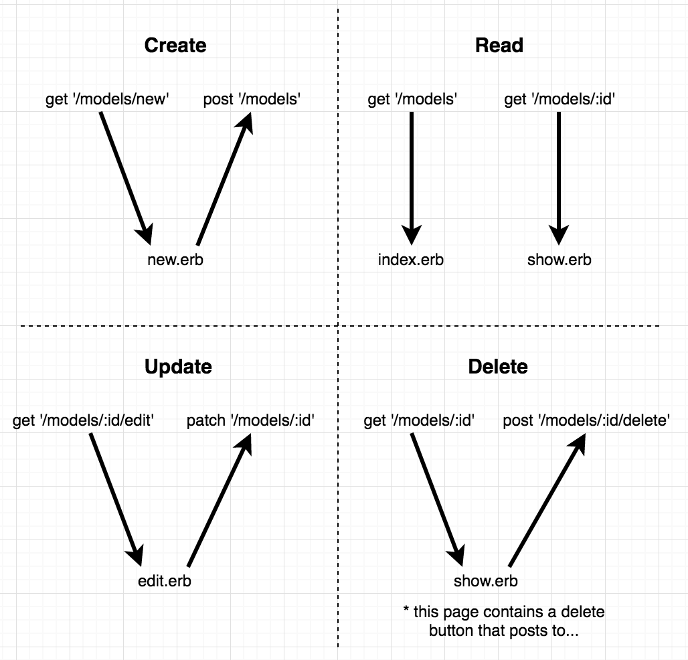
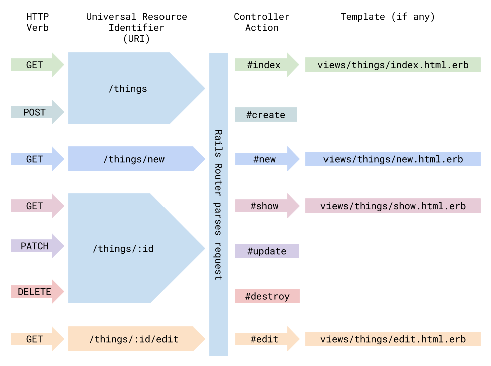

# Sinatra 4. ActiveRecord, Authentication, Sessions, REST
**Title**: Sinatra ActiveRecord, User Authentication, Sessions, and RESTful Routes
**Description**: We will be going over concepts later on in the Sinatra curriculum, like ActiveRecord, User Authentication, Sessions, and RESTful Routes

## Table of Contents
1. Sinatra RESTful Routes
2. ActiveRecord in Sinatra
3. Securing Passwords
<!-- 4. User Authentication and Sessions -->
5. Helper methods (optional)

## ActiveRecord in Sinatra
- You can perform the CRUD actions using active record
- Make sure the students understand which controller actions render which views, and which views have forms that send requests to which controller actions:


[Image Source](https://learn.co/tracks/full-stack-web-development-v7/sinatra/activerecord/activerecord-in-sinatra)

More Resources: [CRUD actions (and methods)](https://guides.rubyonrails.org/active_record_basics.html)

## Sinatra RESTful Routes
- RESTful routes provides a design pattern that allows for easy data manipulation. It’s nicer for users and nicer for developers to have everything consistent.
- Many of the CRUD actions are different actions that occur on the same resource.




[Image Source](https://learn.co/tracks/full-stack-web-development-v7/rails/intro-to-rest/intro-to-rest)

## Securing Passwords in Sinatra
### Setup:
1. Add `password_digest` in user table `t.string :password_digest`
2. Add the `has_secure_password` macro to the user model
3. Add `bcrypt` gem in Gemfile

We can now use the `authenticate` method in our user controller

### [BONUS] Password Encryption with BCrypt
- BCrypt will store a salted, hashed version of our users’ passwords in our database in a column called `password_digest`.
- Encryption vs Hashing vs Salting
	- Encryption is a two-way function where information is scrambled in such a way that it can be unscrambled later. 
	- Hashing is a one-way function where data is mapped to a fixed-length value. Hashing is primarily used for authentication. 
	- Salting is an additional step during hashing, typically seen in association to hashed passwords, that adds an additional value to the end of the password that changes the hash value produced.
	- [More Info](https://www.thesslstore.com/blog/difference-encryption-hashing-salting/)

## User Authentication in Sinatra/Sessions
### Setting up Sessions in Sinatra
- Add code to your application controller:
```
configure do
  enable :sessions
  set :session_secret, "secret"
end
```
- [More info about session secret](http://sinatrarb.com/intro.html)
- Now we can use sessions like this: `session[user_id]`

Code Sign Up/Log In and Log Out
### Sign Up
1. User fills out form sends post to controller
2. We save a new user `User.create(name: params[:name], email: params[:email], password: params[:password])`
3. Sign the user in by setting the user’s id in the session hash
```ruby
post "/users" do
	@user = User.find_by(email: params[:email])

	if @user
		redirect "/login"
	else
		@user = User.new(email: params[:email], password: params[:password])
		if @user.save
			session[:user_id] = @user.id
			redirect "/users/#{@user.id}"
		else
			@email = params[:email]
			erb :signup
		end
	end
end
```

### Log In
- “logging” a user in is essentially storing the user’s ID in the `session` hash
- Login Flow:
	1. User visits login page, fills out form and hits submit to send a post request to the controller
	2. The controller route finds the user and stores the user’s ID in the session hash
	3. Now we can always grab the current user from the session hash
```ruby
post "/login" do
	@user = User.find_by(email: params[:email])
	
	if @user && @user.authenticate(params[:password])
		session[:user_id] = @user.id

		redirect "games"
	else
		redirect "/login"
	end
end
```

### Log Out
Clear the session hash `session.clear`
```ruby
get "/logout" do
	session.clear
	redirect "/"
end
```
